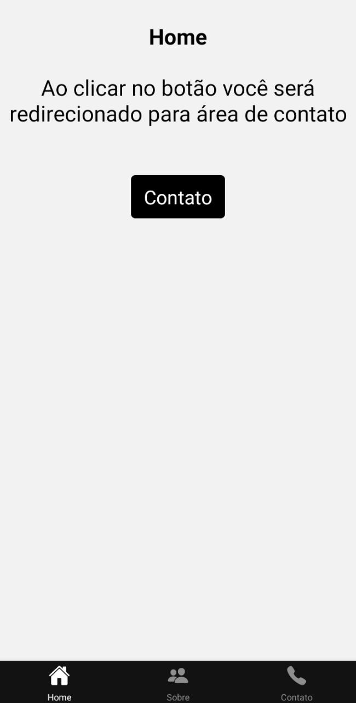
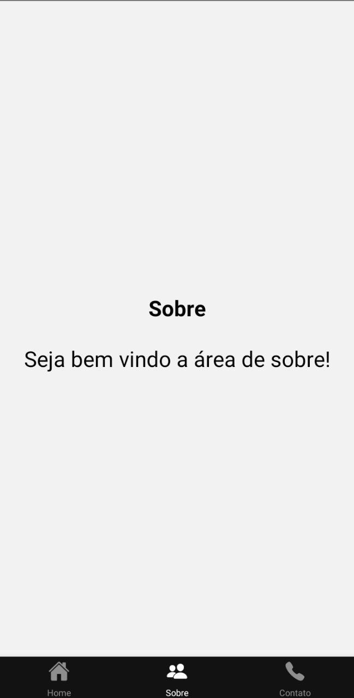

# Navegação tentre telas Botton Tab ReactNative

### Projeto foi elaborado com intuíto de reforçar o apredizado em navegação entre telas dentro do aplicativo.
#





## Tecnologias

- <a href="https://reactnative.dev/">React Natve</a>
- <a href="https://reactnavigation.org/docs/">React Navigation</a>


## Dependências

```
 yarn add react-native/native 

 yarn add react-native-reanimated react-native-gesture-handler react-native-screens react-native-safe-area-context @react-native-community/masked-view

 yarn add react-navigation/botton-tabs

 react-native link

 //Font

 npm install --save react-native-vector-icons

```

## Como correr

``` # Clonar o repositório
git clone https://github.com/devMarililia/nlw

# Entrar no diretório
cd TabBar

# Baixar as dependências
npm i

#Conectar Androd ao devices e habilitar modo desenvolvedor

# Executar no Terminal
yarn start
code .

# Executar no Edtor de Texto
adb devices
yarn android

```
